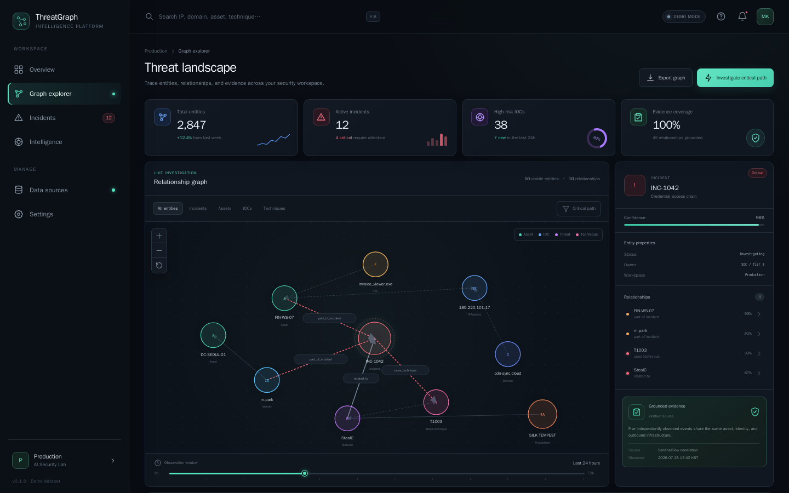
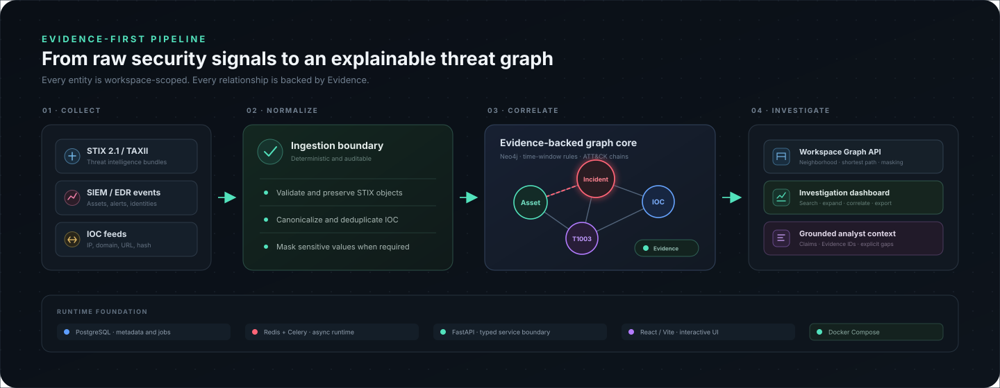
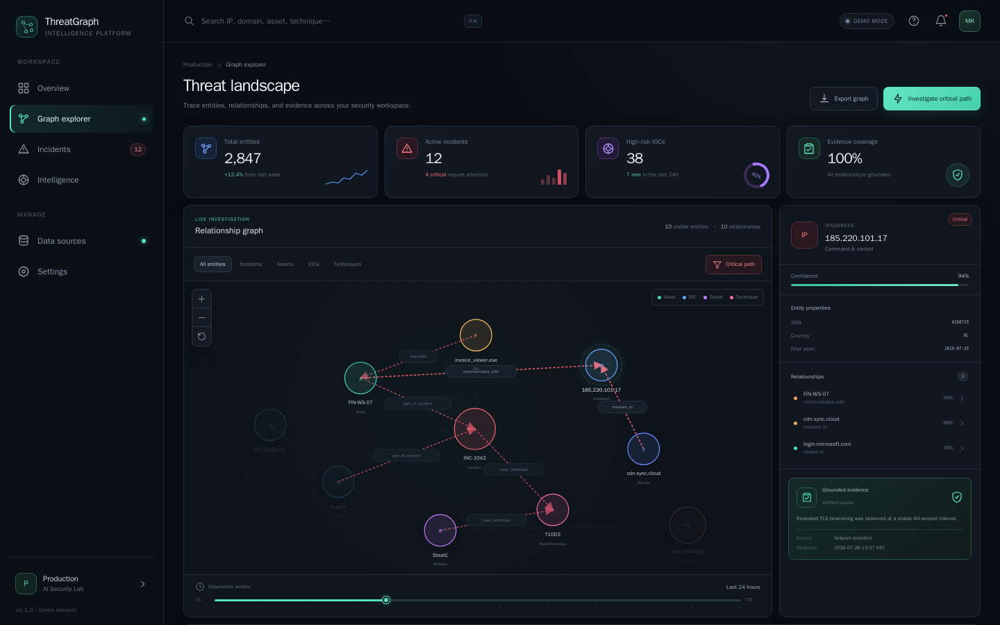
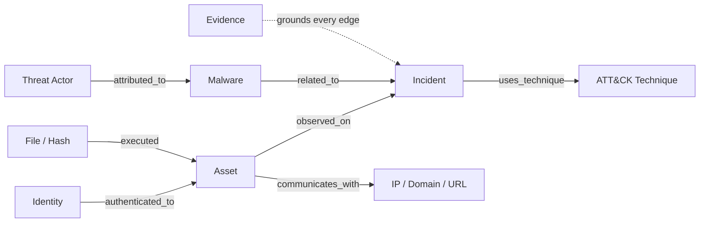
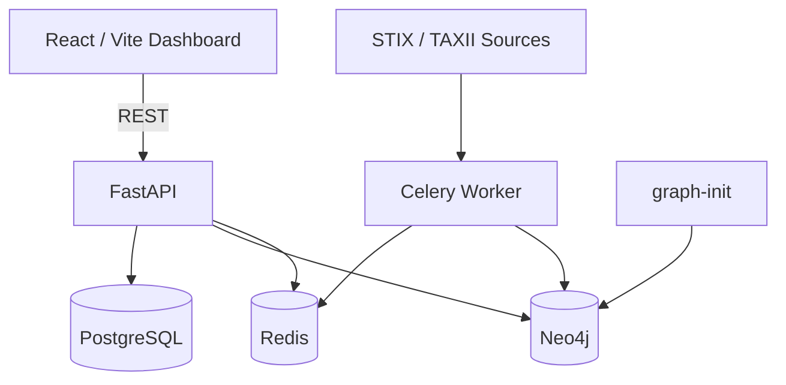

<div align="center">

# ThreatGraph

### Evidence-first Threat Intelligence Graph Platform

보안 이벤트와 IOC를 하나의 그래프로 연결하고, 모든 관계를 검증 가능한 Evidence로 설명합니다.

[](https://github.com/MintKangaroo/ThreatGraph/actions/workflows/ci.yml)
[](https://www.python.org/)
[](https://fastapi.tiangolo.com/)
[](https://react.dev/)
[](https://neo4j.com/)
[](https://oasis-open.github.io/cti-documentation/)
[](#품질-검증)
[](#현재-구현-상태)
[](https://github.com/MintKangaroo/ThreatGraph/releases/tag/v0.1.0)
[](LICENSE)

</div>

<p align="center">
  
  <br />
  <sub>Workspace overview — metrics, grounded correlation, relationship graph, and Evidence</sub>
</p>

> [!NOTE]
> 대시보드는 별도 데이터 없이도 데모 그래프로 즉시 실행됩니다. 워크스페이스 UUID를
> 설정하면 동일한 화면이 workspace-scoped Graph API를 통해 Neo4j 데이터를 조회합니다.

## ThreatGraph가 해결하는 문제

SIEM, EDR, CTI 피드에 흩어진 관측값만으로는 공격의 전체 흐름과 판단 근거를 빠르게
설명하기 어렵습니다. ThreatGraph는 자산, 사용자, IOC, 악성코드, 인시던트, ATT&CK
Technique를 하나의 그래프로 정규화하고, 관계마다 Evidence와 신뢰도·관측 시간을
필수로 기록합니다.

| Correlate | Investigate | Explain | Isolate |
| --- | --- | --- | --- |
| STIX 객체와 IOC를 결정적 identity로 중복 제거 | 검색·필터·시간 범위로 공격 경로 탐색 | 모든 edge에 출처와 Evidence 연결 | 모든 저장·조회가 `workspace_id`로 제한 |

## 한눈에 보는 데이터 흐름

<p align="center">
  
</p>

1. **Collect** — STIX/TAXII, SIEM·EDR 이벤트, IOC 피드를 입력받습니다.
2. **Normalize** — 객체를 검증·보존하고 IOC를 canonicalize, deduplicate, mask합니다.
3. **Correlate** — 시간창·공통 IOC/자산/사용자·ATT&CK chain 규칙으로 관련 활동을 찾습니다.
4. **Investigate** — 제한된 Graph API와 근거 내러티브로 경로·Evidence를 함께 조사합니다.

## 주요 기능

### Interactive investigation dashboard

- 인시던트, 자산, IOC, 위협 행위자, ATT&CK Technique 관계 시각화
- 전역 엔터티 검색과 유형별 필터
- Critical path 강조와 1–72시간 관측 범위 조절
- 노드 선택에 따라 갱신되는 속성·관계·Evidence 패널
- Evidence 인용 수와 명시적 gap을 표시하는 grounded correlation 요약
- 라이브 노드 더블클릭으로 서버 기반 2-hop neighborhood 확장
- 확대·축소·초기화 및 현재 subgraph JSON 내보내기
- API 상태 표시, 오프라인 데모 fallback, 반응형 레이아웃
- `VITE_WORKSPACE_ID` 또는 `?workspace=<UUID>`를 통한 실제 워크스페이스 조회
- `?view=critical&entity=<ID>` 형태의 공유 가능한 조사 deep link

<p align="center">
  
  <br />
  <sub>Critical path investigation — suspicious edges highlighted with IOC evidence in context</sub>
</p>

### Evidence-first graph core

- 17개 위협 인텔리전스 엔터티와 13개 관계 타입
- `(workspace_id, entity_type, key)` 기반 idempotent entity upsert
- 같은 workspace에 속한 source, target, Evidence가 있을 때만 관계 생성
- 호출자 속성이 identity, workspace, evidence, time 필드를 덮어쓰지 못하도록 검증
- Neo4j constraint/index 30개를 idempotent하게 초기화

### STIX 2.1 & IOC pipeline

- STIX 2.1 Bundle 검증, 원본 보존, import/export
- Domain, IPv4/IPv6, URL, SHA 계열 Indicator pattern 매핑
- 공식 ATT&CK attack-pattern의 Technique/sub-technique, tactic, platform 정규화
- Sigma `attack.t####` 태그를 같은 canonical Technique identity로 매핑
- TAXII 비동기 입력 경계와 최대 객체 수 제한
- IP, domain, URL, hash canonicalization과 안정적인 identity
- 중복 제거 및 선택적 민감 IOC 마스킹

### Explainable correlation & integrations

- 최대 30일 시간창 안에서 공통 IOC·asset·identity pivot 상관분석
- 인시던트에 연결된 복수 ATT&CK Technique chain 탐지
- 입력 facts가 같으면 같은 UUID가 생성되는 결정적 finding
- claim마다 relationship ID, Evidence ID, confidence를 보존하는 grounded narrative
- AI-SOC Dashboard, AutoPentest AI, SentinelFlow용 versioned export envelope

### Platform foundation

- FastAPI liveness/readiness, graph exploration, correlation 및 export API
- PostgreSQL metadata store, Neo4j graph store, Redis/Celery runtime
- Docker Compose 서비스 의존성·healthcheck·영구 볼륨
- Python strict typing, 100% backend coverage, React interaction tests

## 현재 구현 상태

> [!IMPORTANT]
> **MVP Core 완성도: 100% (초기 로드맵 10/10 완료).** 아래 기능은 모두 구현·테스트되어
> Docker Compose로 실행할 수 있습니다. 인증/권한, 실제 TAXII credential, downstream
> 전송 transport는 사용하는 조직의 인프라에 맞춰 연결하는 배포 영역입니다.

| 영역 | 상태 | 구현 내용 |
| --- | :---: | --- |
| Platform foundation | ✅ | FastAPI, PostgreSQL, Neo4j, Redis/Celery, React, Compose |
| Graph schema & repository | ✅ | Typed model, Evidence edge, workspace isolation, idempotent upsert |
| STIX 2.1 ingestion | ✅ | Bundle import/export, object mapping, TAXII boundary, raw preservation |
| IOC normalization | ✅ | Canonical identity, deduplication, optional masking |
| ATT&CK knowledge mapping | ✅ | Technique/sub-technique identity, STIX metadata, Sigma tags |
| Correlation engine | ✅ | 시간창, 공통 IOC/asset/identity, ATT&CK technique chain |
| Graph Query API | ✅ | Pagination, time range, neighborhood, incident graph, shortest path, masking |
| Investigation dashboard | ✅ | Search, filters, timeline, correlation, server expansion, export, live/demo |
| Grounded narratives | ✅ | Relationship/Evidence 인용, confidence, explicit gaps |
| Platform adapters | ✅ | AI-SOC Dashboard, AutoPentest AI, SentinelFlow export contracts |

> 대시보드의 기본 시나리오는 UI 기능을 바로 확인하기 위한 데모 데이터입니다.
> 실제 그래프 조회 경계와 민감 데이터 마스킹은 백엔드 API에 구현되어 있습니다.

## 빠른 시작

### Docker Compose

필요 환경: Docker Engine과 Docker Compose v2

```bash
git clone https://github.com/MintKangaroo/ThreatGraph.git
cd ThreatGraph
cp .env.example .env
docker compose up --build
```

| Service | URL | 역할 |
| --- | --- | --- |
| Dashboard | <http://localhost:5173> | 그래프 탐색과 Evidence 확인 |
| API / OpenAPI | <http://localhost:8000/docs> | 상태·그래프·상관분석 API |
| Neo4j Browser | <http://localhost:7474> | 로컬 그래프 관리 |

`graph-init`이 API와 worker 시작 전에 constraint와 index를 설치합니다. 서비스는
`docker compose down`으로 종료합니다. 로컬 데이터까지 삭제해야 할 때만
`docker compose down --volumes`를 사용하십시오.

### 실제 워크스페이스 연결

`.env`에 조회할 UUID를 지정하고 web 서비스를 다시 시작합니다.

```dotenv
VITE_WORKSPACE_ID=00000000-0000-4000-8000-000000000001
```

일회성으로 확인하려면 다음 URL도 사용할 수 있습니다.

```text
http://localhost:5173/?workspace=00000000-0000-4000-8000-000000000001
```

워크스페이스에 노드가 없거나 API 조회가 실패하면 대시보드는 데모 데이터로 안전하게
fallback합니다.

### 로컬 개발

필요 환경: Python 3.12+, Node.js 20+

```bash
python3.12 -m venv .venv
source .venv/bin/activate
make install web-install
make check
```

```bash
make dev          # 전체 스택
make test         # Python tests
make web-test     # React tests
make web-build    # production web build
make graph-schema # Neo4j schema only
```

## API

기본 prefix는 `/api/v1`입니다.

| Method | Endpoint | 설명 |
| --- | --- | --- |
| `GET` | `/health/live` | API process liveness |
| `GET` | `/health/ready` | PostgreSQL, Neo4j, Redis readiness |
| `GET` | `/workspaces/{workspace_id}/graph` | workspace subgraph 조회 |
| `GET` | `/workspaces/{workspace_id}/graph/entities/{entity_id}/neighborhood` | bounded neighborhood 확장 |
| `GET` | `/workspaces/{workspace_id}/graph/paths/shortest` | bounded shortest path |
| `GET` | `/workspaces/{workspace_id}/graph/incidents/{incident_id}` | incident 중심 subgraph |
| `GET` | `/workspaces/{workspace_id}/analysis/correlations` | 근거 기반 상관분석과 내러티브 |
| `GET` | `/workspaces/{workspace_id}/analysis/exports/{platform}` | 플랫폼 export envelope |

Graph API는 `limit=1..200`, traversal depth, time range를 제한합니다. `sensitive=true`
엔터티의 key, name, properties는 API 경계에서 마스킹됩니다.

```bash
curl "http://localhost:8000/api/v1/workspaces/\
00000000-0000-4000-8000-000000000001/graph?limit=100&offset=0"
```

```json
{
  "nodes": [],
  "relationships": [],
  "total_nodes": 0,
  "limit": 100,
  "offset": 0,
  "next_offset": null
}
```

세부 응답과 보안 동작은 [API 문서](docs/api.md)를 참고하십시오.

## 그래프 모델



모든 relationship은 다음 필드를 필수로 가집니다.

```text
source · first_seen · last_seen · confidence · evidence_id · workspace_id
```

전체 entity identity와 relationship 규칙은
[Graph Schema](docs/graph-schema.md)에 정리되어 있습니다.

## 아키텍처



- PostgreSQL: workspace, job, integration metadata
- Neo4j: workspace-scoped entities, relationships, Evidence
- Redis/Celery: 비동기 ingestion과 correlation 실행 경계
- React/Vite: 데모 또는 실제 workspace graph를 탐색하는 운영 UI

더 자세한 설계는 [Architecture](docs/architecture.md)와
[Threat Model](docs/threat-model.md)을 참고하십시오.

## 프로젝트 구조

```text
threatgraph/
├── src/threatgraph/
│   ├── api/              # FastAPI routes and lifecycle
│   ├── graph/            # typed models, schema, Neo4j repository
│   ├── infrastructure/   # PostgreSQL, Neo4j, Redis resources
│   ├── ioc/              # normalization, identity, masking
│   ├── stix/             # STIX mapping, store, TAXII boundary
│   ├── attack.py         # ATT&CK and Sigma technique identity
│   ├── correlation.py    # bounded deterministic graph rules
│   ├── narrative.py      # Evidence-grounded explanations
│   ├── platforms.py      # downstream export contracts
│   └── worker/           # Celery runtime
├── web/src/              # React investigation dashboard
├── tests/unit/           # backend unit tests
├── docs/                 # architecture and domain documentation
└── compose.yaml
```

## 품질 검증

현재 검증 기준:

- Backend: **96 tests**, **100% statement coverage**
- Frontend: **12 tests**, dashboard rendering, API fallback, graph selection/filter, deep link,
  global search, neighborhood and correlation adapters
- `ruff` lint/format, strict `mypy`, TypeScript build
- Docker Compose configuration validation
- GitHub Actions backend/web/compose/graph integration jobs

```bash
make check
```

## 보안 원칙

- 모든 graph read/write는 `workspace_id`로 격리합니다.
- 관계는 동일 workspace의 Evidence 없이는 생성되지 않습니다.
- Query API는 결과 크기를 제한하고 민감 엔터티를 응답 전에 마스킹합니다.
- 그래프 traversal depth와 correlation time window를 제한해 과도한 쿼리를 차단합니다.
- 내러티브와 플랫폼 export는 relationship/Evidence ID를 끝까지 유지합니다.
- readiness 오류는 내부 host, credential, stack trace를 노출하지 않습니다.
- Compose의 기본 secret은 격리된 로컬 개발 전용입니다.
- 승인 없는 대상 스캔이나 공격 행위는 이 프로젝트의 범위가 아닙니다.

취약점 신고 절차는 [SECURITY.md](SECURITY.md)를 확인하십시오.

## 문서

| 문서 | 내용 |
| --- | --- |
| [Architecture](docs/architecture.md) | 서비스와 프로세스 경계 |
| [Graph Schema](docs/graph-schema.md) | entity, relationship, identity 규칙 |
| [STIX 2.1](docs/stix.md) | import/export와 지원 객체 |
| [IOC Pipeline](docs/ioc.md) | 정규화, 중복 제거, 마스킹 |
| [ATT&CK Mapping](docs/attack.md) | Technique identity와 Sigma tag 매핑 |
| [Correlation](docs/analysis.md) | 시간창 규칙과 Evidence grounding |
| [API](docs/api.md) | health, graph, analysis, export 계약 |
| [Platform Integrations](docs/integrations.md) | downstream envelope와 event type |
| [Threat Model](docs/threat-model.md) | trust boundary와 abuse case |
| [Roadmap](docs/roadmap.md) | 완료된 MVP와 Post-MVP 운영 통합 |
| [Session Handoff](HANDOFF.md) | 다음 세션 시작점, 검증 결과, 실행 절차 |
| [Contributing](CONTRIBUTING.md) | 개발·검증·브랜치 규칙 |

## 기여 및 라이선스

기여 전 [CONTRIBUTING.md](CONTRIBUTING.md)의 브랜치와 검증 규칙을 확인해 주세요.
ThreatGraph는 [MIT License](LICENSE)로 배포됩니다.

<div align="center">
  <sub>Built for explainable, evidence-grounded security operations.</sub>
</div>
