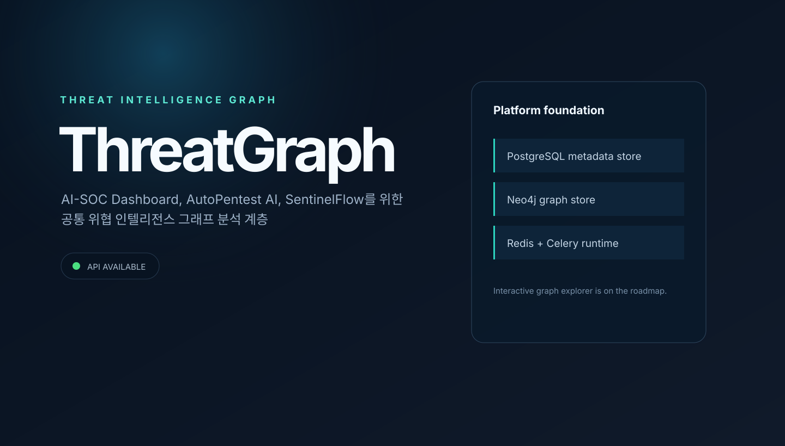

# ThreatGraph

<p align="center">
  
</p>

<p align="center">보안 이벤트와 IOC를 증거 기반 그래프로 연결하는 Threat Intelligence 플랫폼</p>

<p align="center">
  <a href="https://github.com/MintKangaroo/ThreatGraph"></a>
  <a href="https://github.com/MintKangaroo/ThreatGraph/tree/develop"></a>
</p>

ThreatGraph는 AI-SOC Dashboard, AutoPentest AI, SentinelFlow가 공통으로 사용하는 그래프
분석 계층입니다. 증거를 보존하고 워크스페이스 간 데이터를 격리하면서 자산, 이벤트,
IOC, 취약점, 위협 행위자, MITRE ATT&CK 기법(Technique)을 연결하고 상관분석하는 위협
인텔리전스 플랫폼을 목표로 합니다.

> 현재 상태: STIX 2.1 번들 수집·보존·내보내기 계층까지 구현되었습니다. 다음 단계는 IOC
> 정규화 및 중복 제거입니다.

## 목차

- [프로젝트 개요](#프로젝트-개요)
- [현재 구현 범위](#현재-구현-범위)
- [아키텍처](#아키텍처)
- [빠른 시작](#빠른-시작)
- [STIX 2.1 수집](#stix-21-수집)
- [그래프 모델](#그래프-모델)
- [품질과 보안 원칙](#품질과-보안-원칙)
- [로드맵](#로드맵)

## 프로젝트 개요

ThreatGraph는 서로 다른 보안 데이터 소스를 하나의 workspace-scoped 그래프로 통합합니다.
수집된 이벤트에서 IOC를 추출하고, 엔터티를 정규화한 뒤, 관계·Evidence·MITRE ATT&CK
Technique를 연결하여 시간 기반 상관분석과 설명 가능한 탐색을 제공합니다.

핵심 흐름은 다음과 같습니다.

`보안 이벤트 수집 → IOC 추출 → 엔터티 정규화 → 관계 생성 → ATT&CK 매핑 → 시간 기반 상관분석 → 그래프 탐색 → 근거 기반 설명`

## 기반 서비스

- 생존 상태(liveness) 및 종속 서비스 준비 상태(readiness) 엔드포인트를 제공하는
  FastAPI 서비스
- 메타데이터 저장소인 PostgreSQL과 그래프 저장소인 Neo4j
- 17개 위협 인텔리전스 엔터티와 13개 Evidence 기반 관계 스키마
- workspace 격리와 idempotent entity upsert를 적용한 Neo4j Repository
- STIX 2.1 bundle importer/exporter와 TAXII 입력 경계
- Redis 기반 Celery 워커 실행 환경
- React 및 Vite 기반 웹 기본 화면
- 영구 서비스 볼륨을 포함한 Docker Compose 개발 환경
- Python 및 웹 품질 검사를 수행하는 CI

## 현재 구현 범위

현재 `main`과 `develop`에는 플랫폼 기반 및 그래프 스키마가 포함되어 있으며,
`feat/stix-ingestion`에는 STIX 2.1 수집 계층이 추가되어 있습니다.

| 영역 | 상태 | 내용 |
| --- | --- | --- |
| 플랫폼 기반 | 완료 | FastAPI, PostgreSQL, Neo4j, Redis/Celery, React, Docker Compose |
| 그래프 계층 | 완료 | 타입 모델, workspace 격리, Evidence 검증, idempotent upsert |
| STIX 2.1 | 완료 | Bundle import/export, 원본 보존, 지원 객체 매핑, TAXII 입력 경계 |
| IOC 파이프라인 | 예정 | canonical identity, 중복 제거, 민감 값 마스킹 |
| 상관분석·Query API | 예정 | 시간 창, 공통 IOC/자산/사용자, pagination 기반 탐색 |
| 시각화·AI 설명 | 예정 | Cytoscape.js 탐색기, Evidence 패널, 근거 기반 narrative |

## 빠른 시작

전체 로컬 환경은 Docker Compose를 사용해 실행합니다.

```bash
cp .env.example .env
docker compose up --build
```

`graph-init` 서비스가 API와 worker보다 먼저 Neo4j constraint 및 index를 idempotent하게
설치합니다. 로컬 Python 환경에서는 `make graph-schema`로 같은 작업을 직접 실행할 수
있습니다.

서비스가 시작되면 다음 주소로 접속할 수 있습니다.

- 웹 화면: <http://localhost:5173>
- API 문서: <http://localhost:8000/docs>
- Neo4j Browser: <http://localhost:7474>

개발 데이터는 이름이 지정된 Docker 볼륨에 저장됩니다. 서비스는
`docker compose down`으로 종료할 수 있습니다. 로컬 데이터까지 삭제하려는 경우에만
`--volumes` 옵션을 추가하십시오.

`.env.example`의 인증 정보는 격리된 로컬 개발 환경 전용입니다. 공유 환경이나 개발
이외의 환경에서는 모든 비밀번호를 반드시 교체해야 합니다. 기본적으로 인프라 포트는
루프백 인터페이스에만 바인딩됩니다.

## 아키텍처

```text
React/Vite
    │ HTTP
FastAPI ───────── PostgreSQL (metadata)
    │
    ├──────────── Neo4j (entities, relationships, Evidence)
    ├──────────── Redis → Celery worker (비동기 작업)
    └──────────── STIX/TAXII adapters
```

PostgreSQL은 workspace, 작업 및 연동 메타데이터를 저장하고 Neo4j는 위협 그래프와
Evidence-backed relationship을 저장합니다. 모든 그래프 읽기·쓰기는 `workspace_id`로
범위를 제한합니다. 상세 설계는 [아키텍처 문서](docs/architecture.md)를 참고하십시오.

## STIX 2.1 수집

STIX bundle은 `STIXBundleImporter`로 검증·매핑하고, `STIXBundleExporter`로 원본 객체를
다시 bundle로 내보낼 수 있습니다. 지원 Indicator 패턴은 domain, IPv4/IPv6, URL, file
hash이며, 지원되지 않는 객체는 `IngestReport.skipped`에 남기고 전체 수집은 계속합니다.
관계가 생성될 때는 같은 workspace의 Evidence가 함께 생성됩니다.

구현 세부사항과 TAXII 어댑터 계약은 [STIX 문서](docs/stix.md)에 정리되어 있습니다.

## 상태 확인 엔드포인트

- `GET /api/v1/health/live`: API 프로세스가 요청을 처리할 수 있는지 확인합니다.
- `GET /api/v1/health/ready`: 제한 시간 안에 PostgreSQL, Neo4j, Redis 연결 상태를
  확인합니다.

준비 상태 검사에 실패하면 구성요소별 `up` 또는 `down` 상태만 반환합니다. 연결 정보와
내부 오류는 외부에 노출하지 않습니다.

## 로컬 품질 검사

컨테이너 외부에서 개발하려면 Python 3.12와 Node.js 20 이상이 필요합니다.

```bash
python3.12 -m venv .venv
source .venv/bin/activate
make install web-install
make check
```

Python 테스트만 실행하려면 `make test`, 웹 테스트만 실행하려면 `make web-test`를
사용합니다.

## 그래프 스키마

모든 entity는 `workspace_id`와 type별 identity key로 식별됩니다. 동일 workspace에서
동일한 identity key를 다시 저장하면 새 node를 무제한 생성하지 않고 기존 node를
갱신합니다.

모든 relationship은 다음 속성을 필수로 가집니다.

- `source`
- `first_seen`, `last_seen`
- `confidence`
- `evidence_id`
- `workspace_id`

Repository는 source entity, target entity, Evidence가 모두 같은 workspace에 있을 때만
relationship을 생성합니다. 지원하는 전체 schema와 저장 규칙은
[그래프 스키마 문서](docs/graph-schema.md)를 참고하십시오.

## 그래프 모델

주요 엔터티는 Asset, Identity, Process, File, Domain, IPAddress, URL, Hash, Vulnerability,
Alert, Incident, ThreatActor, Malware, Campaign, AttackTechnique, DataSource, Evidence입니다.
관계에는 communicates_with, resolves_to, downloaded, executed, observed_on, authenticated_to,
exploited, related_to, attributed_to, uses_technique, affected_by, mitigated_by,
part_of_incident가 있습니다.

모든 관계는 `source`, `first_seen`, `last_seen`, `confidence`, `evidence_id`, `workspace_id`를
필수로 가집니다. 전체 제약과 identity 규칙은 [그래프 스키마 문서](docs/graph-schema.md)를
참고하십시오.

## 품질과 보안 원칙

- workspace 간 데이터는 저장·조회·관계 생성 단계에서 격리합니다.
- 모든 관계는 동일 workspace의 Evidence를 요구합니다.
- 결정적 identity와 MERGE로 동일 IOC의 무제한 중복 노드 생성을 방지합니다.
- 그래프에 없는 관계를 AI 설명이 사실처럼 생성하지 않도록 Evidence를 근거로 사용합니다.
- 대규모 Query API에는 limit과 pagination을 적용합니다.
- 민감한 IOC는 정규화 단계에서 마스킹할 수 있도록 설계합니다.

## 아직 구현하지 않은 범위

- IOC 정규화 파이프라인과 선택적 민감 IOC 마스킹
- MITRE ATT&CK 및 Sigma 매핑
- 시간 기반 이벤트 상관분석과 그래프 조회 API
- Cytoscape.js 기반 그래프 탐색기
- AI 기반 인시던트 설명과 외부 플랫폼 어댑터

STIX 가져오기 사용법과 지원 범위는 [STIX 문서](docs/stix.md)를 참고하십시오. 대상 스캔이나 공격 행위도 구현하지 않습니다. 자세한 내용은
[그래프 스키마](docs/graph-schema.md), [아키텍처](docs/architecture.md),
[로드맵](docs/roadmap.md),
[보안 정책](SECURITY.md)을 참고하십시오.

## 기여

개발 및 검증 절차는 [CONTRIBUTING.md](CONTRIBUTING.md)를 참고하십시오. 이 프로젝트는
MIT License로 배포됩니다.
